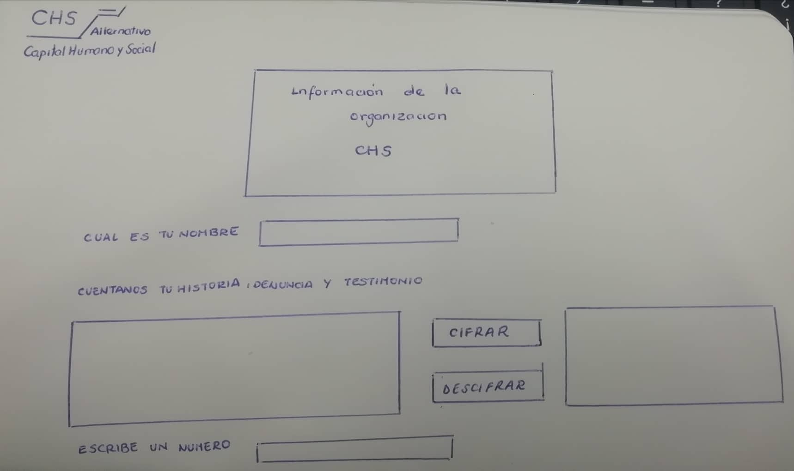

# CHS Alternativo - CIFRADO CESAR

## Índice

[1. Preámbulo](#1-preámbulo)  
[2. Resumen del proyecto](#2-Resumen-del-proyecto)   
[3. Imagen final del proyecto](#3-Imagen-final-del-proyecto)  
[4. Investigación UX](#4-Investigación-UX) 
    

***

## 1. Preámbulo

Cifrar significa codificar. El cifrado césar es una de las técnicas más simples para cifrar un mensaje. Es
un tipo de cifrado por sustitución, es decir que cada letra del texto original
es reemplazada por otra que se encuentra un número fijo de posiciones
(desplazamiento) más adelante en el mismo alfabeto.

Por ejemplo, si usamos un desplazamiento (_offset_) de 3 posiciones:

* La letra A se cifra como D.
* La palabra CASA se cifra como FDVD.
* Alfabeto sin cifrar: A B C D E F G H I J K L M N O P Q R S T U V W X Y Z
* Alfabeto cifrado: D E F G H I J K L M N O P Q R S T U V W X Y Z A B C

## 2. Resumen del proyecto

El proyecto CHS Alternativo - Cipher Cesar tiene como finalidad de que las personas victimas de trata de personas, ESNNA, trabajo infantil y trabajo forzoso puedan hacer sus denuncias y contar sus casos para poder ayudarlas.

## 3. Imagen final del proyecto

  ### **3.1. Pantalla de Inicio.**

  En esta pantalla se encuentra la informacion de la organización y dos botones: (CONTAR HISTORIA) Y (DESCIFRAR CODIGO). Dichos botones nos llevaran a otras pantallas.

  

  ### **3.2. Pantalla de Realizar denuncia/ Contar Historia.**

  En esta pantalla, la persona escribira su nombre, una clave( ayudará en el proceso de cifrado) y su testimonio.

  

  ### **3.3. Pantalla de Descifrado de mensajes.**

  En esta pantalla la persona digitara una clave y el mensaje que desea cifrar.

  

## 4. Investigación UX

### **4.1. Usuarios y Objetivos del proyecto.**

  [CHS Alternativo](http://chsalternativo.org/chs-alternativo/) es una una organización con 15 años de trabajo promoviendo la protección de los derechos humanos de las personas, en particular de las niñas, niños y adolescentes. 

  #### *a) Usuarios*
  
  Directos:  
  Los usuarios directos son aquellas personas que han sido victimas de trata de personas, ESNNA(Explotacion sexual de niños, niñas y adolescentes),trabajo forzoso y otros casos que derivan de ellos.

  Indirectos:  
  Los usuarios indirectos son personas que han presenciado algun caso y quieren denunciar.
  Personas cuyo familiar esta desaparecido.

  #### *b) Objetivos*

  Principal:

  * El objetivo principal es que las personas puedan hacer denuncias con la seguridad de que sus datos e información no seran revelados .

  Secundarios:
    
  * Poder tener una comunicación más rapida entre la victima y la institución.

  * Lograr la mayor detección de casos para brindar apoyo.

  * Generar mayor apoyo por parte de las personas que no son victimas pero que han presenciado estos casos.

### **4.2. Solución de problemas y necesidades de los usuarios.**

El proyecto ayudara a detectar los casos de trata de personas, ESNNA, trabajo forzoso y otros; debido a que las personas haran sus denuncias en la pagina web.

Los denunciantes no tendran temor a denunciar debido a que sus datos e informacion seran cifradas, lo que ayuda a protegerlos.

Una vez que ellos hagan la denuncia, toda la informacion sera registrada y estara cifrada, para que solo el personal autorizado tenga conocimiento de ello. Para poder descifrarla es necesaria la clave que los denunciantes ponen al momento de hacer su denuncia.

Para poder estar en contacto con los denunciantes, nosotros enviaremos informacion cifrada a su correo el cual podran descifrar con la clave que se le envio y accediendo a la pagina.

### **4.3. Primer prototipo en papel.**

### **4.4. Feedback recibido y mejoras realizadas.**

#### *a) Feedback recibido*

 * Hacer una pantalla de inicio.
 * Poner el nombre y el codigo uno debajo de otro.
 * Darle mejor distribucion de los elemntos.
 * Agregar botones de reiniciar.

#### *b) Mejoras Realizadas*

* Agregar una pantallade inicio donde se enccuentra la informacion de la organización y dos botones de **CONTAR HISTORIA** y **DESCIFRAR CODIGO**.
* Se creo dos nuevas pantallas, una de **CIFRADO** y otra de **DESCIFRADO**.
* Se agrego botones a las dos pantallas: uno de **CIFRAR o DESCIFRAR**, otro de **LIMPIAR** y uno de **VOLVER AL INICIO**.

### **4.5. Imagen del prototipo final.**

El prototipo final esta realizado en **FIGMA** :

### *a) Pantalla de Inicio.*

### *b) Pantalla de Realizar denuncia/ Contar Historia.*
  

### *c) Pantalla de Descifrado de mensajes.*
  

***

## Objetivos de aprendizaje Cipher

A continuación te presentamos los objetivos de aprendizaje de este proyecto. Reflexiona y luego marca los objetivos que has llegado a **entender** y **aplicar** en tu proyecto.

### UX

- [x] Diseñar la aplicación pensando y entendiendo al usuario.
- [x] Crear prototipos para obtener feedback e iterar.
- [x] Aplicar los principios de diseño visual (contraste, alineación, jerarquía).

### HTML y CSS

- [ ] Uso correcto de HTML semántico.
- [x] Uso de selectores de CSS.
- [x] Construir tu aplicación respetando el diseño realizado (maquetación).

### DOM

- [x] Uso de selectores del DOM.
- [x] Manejo de eventos del DOM.
- [x] Manipulación dinámica del DOM.

### Javascript

- [x] Manipulación de strings.
- [ ] Uso de condicionales (if-else | switch).
- [ ] Uso de bucles (for | do-while).	
- [ ] Uso de funciones (parámetros | argumentos | valor de retorno).
- [x] Declaración correcta de variables (const & let).

### Testing
- [ ] Testeo de tus funciones.

### Git y GitHub
- [x] Comandos de git (add | commit | pull | status | push).
- [ ] Manejo de repositorios de GitHub (clone | fork | gh-pages).

### Buenas prácticas de desarrollo
- [ ] Uso de identificadores descriptivos (Nomenclatura | Semántica).
- [ ] Uso de linter para seguir buenas prácticas (ESLINT).
